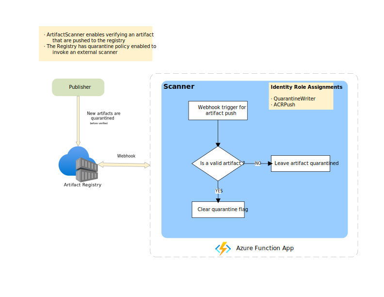

# What's this

This a sample project that demonstrates how to use ACR webhook and quarantine feature to implement custom image scanning logic. The target scenario is a container registry that filters image pushes by content. Only images that pass scan are pullable.

A newly pushed image will go through the following flow:
1. Image is quarantined. At this stage, users without quarantine read permission cannot access the image.
1. Scanner is notified of the image push via webhook.
1. Scanner scans image (manifest and blobs) content. 
1. If image passes check, scanner will clear quarantine flag on the image, which makes it pullable for all users.
1. Otherwise, the image remains quarantined.

A webhook is implemented in C# to scan images and check for Bicep files. The webhook can be deployed to Azure Function App.




# Try it out

## Prerequisites

- An Azure subscription
- [Azure CLI](https://learn.microsoft.com/en-us/cli/azure/)
- [Oras CLI](https://oras.land/docs/cli/installation)

## Create Azure Container Registry

```bash
rnd=$RANDOM
group_name="scannerdemo$rnd"
acr_name="scannercr$rnd"
location=eastus
az group create --name $group_name --location $location
az acr create --resource-group $group_name --name $acr_name --sku Premium
```

Login to verify the registry works:

```bash
az acr login -n $acr_name -t -o tsv --query accessToken | oras login --password-stdin ${acr_name}.azurecr.io
```

## Enable registry quarantine state

Registry quarantine state can be checked by:

```bash
az acr show -n $acr_name -o tsv --query policies.quarantinePolicy
```

Enable quarantine state by

```bash
acr_id=$(az acr show -n $acr_name -o tsv --query id)
acr_id=${acr_id%%[[:cntrl:]]}
az rest --method patch --url "https://management.azure.com${acr_id}?api-version=2023-01-01-preview" --body '{"properties":{"policies":{"quarantinePolicy":{"status":"enabled"}}}}'
```

Verify quarantine works. Note that in the execution below, newly pushed image is quarantined.

```console
$ oras push ${acr_name}.azurecr.io/scanner-test:v1 hi.txt
Exists    b5bb9d8014a0 hi.txt
Pushed [registry] scannertestcr.azurecr.io/scanner-test:v1
Digest: sha256:d4129e7a956ed858fdfbe75a004b95c1b626048028f23915b79e10508c1359d7

$ # Fetch with an identity that doesn't have quaratine role fails:
$ oras manifest fetch ${acr_name}.azurecr.io/scanner-test@sha256:d4129e7a956ed858fdfbe75a004b95c1b626048028f23915b79e10508c1359d7
Error: failed to fetch the content of "scannertestcr.azurecr.io/scanner-test@sha256:d4129e7a956ed858fdfbe75a004b95c1b626048028f23915b79e10508c1359d7": GET "https://scannertestcr.azurecr.io/v1/scanner-test/manifests/sha256:d4129e7a956ed858fdfbe75a004b95c1b626048028f23915b79e10508c1359d7": response status code 403: image quarantined: The image is quarantined.: map[]
```

## Create Azure Function App

Create an Azure Function App to serve as webhook:

```bash
app_name="scanner-func$rnd"
storage="funcappstorage$rnd"

# Create an Azure storage account in the resource group.
az storage account create --name $storage --location "$location" --resource-group $group_name --sku "Standard_LRS"

# Create a function app with source files deployed from this GitHub repo.
az functionapp create --name $app_name --storage-account $storage --consumption-plan-location "$location" --resource-group $group_name \
    --deployment-source-url https://github.com/m5i-work/acr-scanner \
    --deployment-source-branch main \
    --functions-version 4 --runtime dotnet
```

## Integrate Function App with ACR

Next, we need to grant permissions to the Function App to pull images and toggle quarantine state.

1. Add a system-assigned identity for Function App

    ```bash
	az functionapp identity assign -g $group_name -n $app_name --identities [system]
    ```
   
1. In ACR registry, [add role assignment](https://learn.microsoft.com/en-us/azure/container-registry/container-registry-roles?tabs=azure-cli#assign-roles) for the identity. Required roles are `AcrQuarantineWriter` and `AcrPush`.

    ```bash
	app_mi_id=$(az functionapp identity show -n $app_name -g $group_name -o tsv --query principalId)
	app_mi_id=${app_mi_id%%[[:cntrl:]]}
	az role assignment create --assignee-object-id $app_mi_id --assignee-principal-type ServicePrincipal --role AcrQuarantineWriter --scope $acr_id
	az role assignment create --assignee-object-id $app_mi_id --assignee-principal-type ServicePrincipal --role AcrPush --scope $acr_id
    ```

1. Add an ACR webhook that calls Function App. The action is `quarantine`. Host of the uri is the same as Function App.

   ```bash
   app_code=$(az functionapp keys list --resource-group $group_name --name $app_name -o tsv --query "functionKeys.default")
   app_code=${app_code%%[[:cntrl:]]}
   az acr webhook create -n scannerfunc -r ${acr_name} --uri https://${app_name}.azurewebsites.net/api/webhook?code=${app_code} --actions quarantine
   ```

## Verify webhook works

First, let's push an OCI image manifest with a normal plain text file as layer:

```bash
echo "foo" > hi.txt
oras push ${acr_name}.azurecr.io/hi:v1 hi.txt
```

Since this file is not a Bicep file, it gets quarantined:

```console
$ oras manifest fetch ${acr_name}.azurecr.io/hi:v1
Error: failed to fetch the content of "scannertestcr.azurecr.io/hi:v1": scannertestcr.azurecr.io/scanner-test:v1: not found
```

We can also check scanner logs on Function App to see what's happening:

```log
Scanning image: hi:sha256:65fefeccfc30b9fee4a8e484497ce0dd8b4c31c37d9234f1bfcf3ac2bc59066a
Stop scanning image, found non-Bicep file: {application/vnd.oci.image.layer.v1.tar sha256:d78931fcf2660108eec0d6674ecb4e02401b5256a6b5ee82527766ef6d198c67 8 [] map[org.opencontainers.image.title:hi.txt] [] <nil> }
```

Next, let's repeat the above with a Bicep file instead. There's a sample Bicep file in `samples`.

```bash
oras push ${acr_name}.azurecr.io/bicep:v1 samples/foo.bicep
```

We can find in scanner logs that this image is moved out of quarantine state:

```log
Scanning image: bicep:sha256:cb8293487d5f197abf0bfc3e8cb88c47430681b711f1ae0444c48dea66470a8f
Quarantine flag cleared for: bicep:sha256:cb8293487d5f197abf0bfc3e8cb88c47430681b711f1ae0444c48dea66470a8f
```

Therefore, it is pullable:

```console
$ oras manifest fetch ${acr_name}.azurecr.io/bicep:v1
{"schemaVersion":2,"mediaType":"application/vnd.oci.image.manifest.v1+json","config":{"mediaType":"application/vnd.unknown.config.v1+json","digest":"sha256:44136fa355b3678a1146ad16f7e8649e94fb4fc21fe77e8310c060f61caaff8a","size":2},"layers":[{"mediaType":"application/vnd.oci.image.layer.v1.tar","digest":"sha256:bff6730639c5cce9a8d5550a709f444d90d746feedce59aec7b5d1072ff8ab2b","size":697,"annotations":{"org.opencontainers.image.title":"foo.bicep"}}],"annotations":{"org.opencontainers.image.created":"2023-06-14T07:22:11Z"}}
```

## Troubleshooting

Check the following if webhook doesn't work:
1. Check "Webhook" blade of ACR web portal, verify that webhook is called.
1. Check if there's any error in webhook response. Upon success, the response should be like:
   ```
   Enqueued scan task for scanner-test@sha256:c9680c500f2bd67a5e9b48083842f02c9380d61207d56e7be93313b889d41589
   ```
1. Check Function App deployment log to find errors.
1. Check Function App application log to find errors.


## Clean up resources

When no longer needed, you can use the `az group delete` command to remove the resource group, and all related resources:

```bash
az group delete --resource-group $group_name
```
